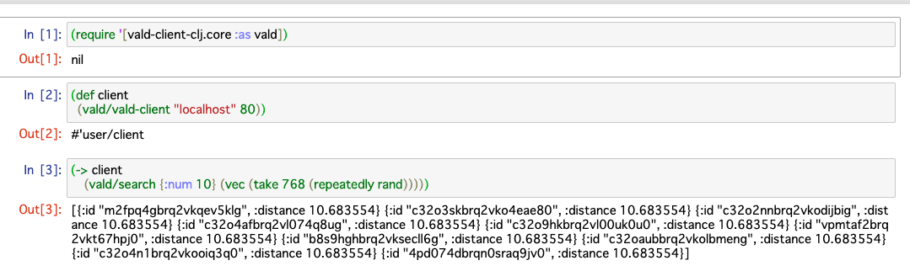

clojupyter-vald-sample
===

Use [vald-client-clj](https://github.com/vdaas/vald-client-clj) from Jupyter Notebook.
Powered by [Clojupyter](https://github.com/clojupyter/clojupyter).

Run Jupyter Notebook
---

    $ docker run -p 8888:8888 -it rinx/clojupyter-vald-sample

Notebook app will be started in the container.

